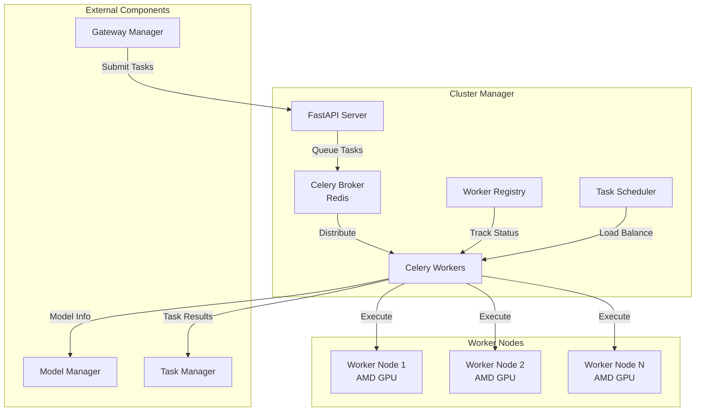
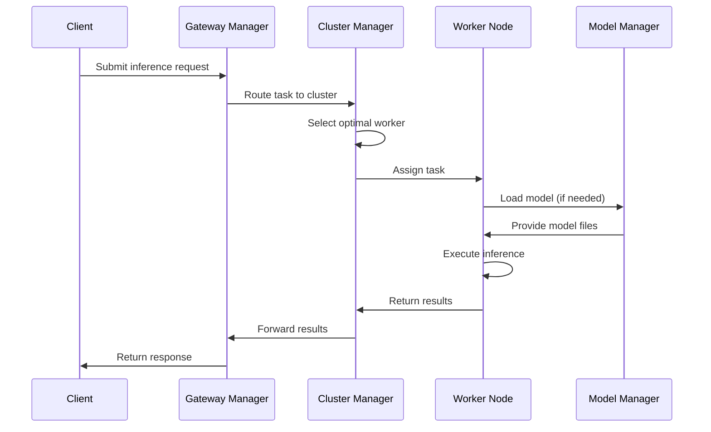

# Cluster Manager Architecture

## Overview

The Cluster Manager is the central orchestration component of the BitingLip system, responsible for task distribution, worker management, and resource coordination across the distributed GPU cluster.

## System Architecture



## Core Components

### 1. FastAPI Server (`app/main.py`)
- **Purpose**: Provides REST API for cluster management
- **Endpoints**:
  - `/health` - Health check
  - `/cluster/status` - Overall cluster status
  - `/workers` - Worker management
  - `/tasks` - Task submission and monitoring
  - `/models` - Model assignment operations

### 2. Celery Broker (Redis)
- **Purpose**: Message queue for task distribution
- **Features**:
  - Task queuing and routing
  - Result backend for task status
  - Worker discovery and monitoring

### 3. Celery Workers
- **Purpose**: Execute inference tasks on GPU nodes
- **Capabilities**:
  - GPU resource management
  - Model loading and caching
  - Task execution and result reporting
  - Health monitoring and auto-recovery

### 4. Worker Registry
- **Purpose**: Tracks worker nodes and their capabilities
- **Data Maintained**:
  - Worker ID and connection status
  - GPU specifications and availability
  - Loaded models and memory usage
  - Performance metrics

## Task Flow



## Data Models

### Worker Status
```python
class WorkerStatus(BaseModel):
    worker_id: str
    status: WorkerState  # online, offline, busy, error
    gpu_info: GPUInfo
    loaded_models: List[str]
    memory_usage: MemoryInfo
    last_heartbeat: datetime
    performance_metrics: Dict[str, float]
```

### Task Assignment
```python
class TaskAssignment(BaseModel):
    task_id: str
    worker_id: str
    model_name: str
    priority: int
    estimated_duration: Optional[float]
    resource_requirements: ResourceRequirements
```

## Load Balancing Strategy

### Algorithm: Weighted Round Robin with GPU Affinity
1. **Worker Selection Criteria**:
   - GPU memory availability
   - Current workload
   - Model affinity (prefer workers with model already loaded)
   - Historical performance metrics

2. **Scheduling Rules**:
   - High-priority tasks get immediate assignment
   - Batch similar tasks to same worker for efficiency
   - Automatic failover on worker failure
   - Dynamic load rebalancing

### GPU Memory Management
- Track memory usage per worker
- Prevent overcommitment
- Automatic model unloading when memory is low
- Intelligent model caching based on usage patterns

## Configuration

### Environment Variables
```bash
# Redis Configuration
REDIS_HOST=localhost
REDIS_PORT=6379
REDIS_DB=0

# Cluster Settings
MAX_WORKERS=10
TASK_TIMEOUT=300
HEARTBEAT_INTERVAL=30

# GPU Settings
GPU_MEMORY_THRESHOLD=0.8
MODEL_CACHE_SIZE=5
AUTO_SCALE_ENABLED=true
```

### Worker Node Requirements
- AMD GPU with ROCm support
- Python 3.10+
- CUDA/ROCm drivers
- Sufficient VRAM for target models
- Network connectivity to cluster manager

## Monitoring and Observability

### Health Checks
- Worker heartbeat monitoring
- GPU health and temperature tracking
- Memory usage alerts
- Task queue depth monitoring

### Metrics Collection
- Task throughput and latency
- GPU utilization per worker
- Model loading times
- Error rates and failure analysis

### Logging
- Structured logging with correlation IDs
- Worker event tracking
- Performance profiling
- Debug trace collection

## Fault Tolerance

### Worker Failure Handling
1. Automatic detection via missed heartbeats
2. Task redistribution to healthy workers
3. Worker auto-restart with exponential backoff
4. Circuit breaker pattern for persistent failures

### Data Consistency
- Redis persistence for task state
- Idempotent task processing
- Graceful shutdown with task completion
- Recovery procedures for partial failures

## Performance Optimization

### Caching Strategies
- Model weight caching on workers
- Result caching for repeated queries
- Preemptive model loading based on patterns

### Resource Optimization
- Dynamic worker scaling
- GPU memory defragmentation
- Batch processing for efficiency
- Pipeline parallelism for large models

## Security Considerations

### Access Control
- Worker authentication via tokens
- API key validation
- Network security groups
- Encrypted inter-service communication

### Resource Isolation
- Container-based worker isolation
- GPU resource quotas
- Memory protection
- Process sandboxing
