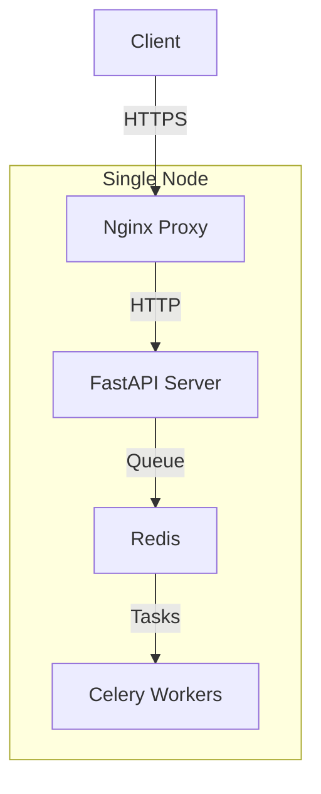
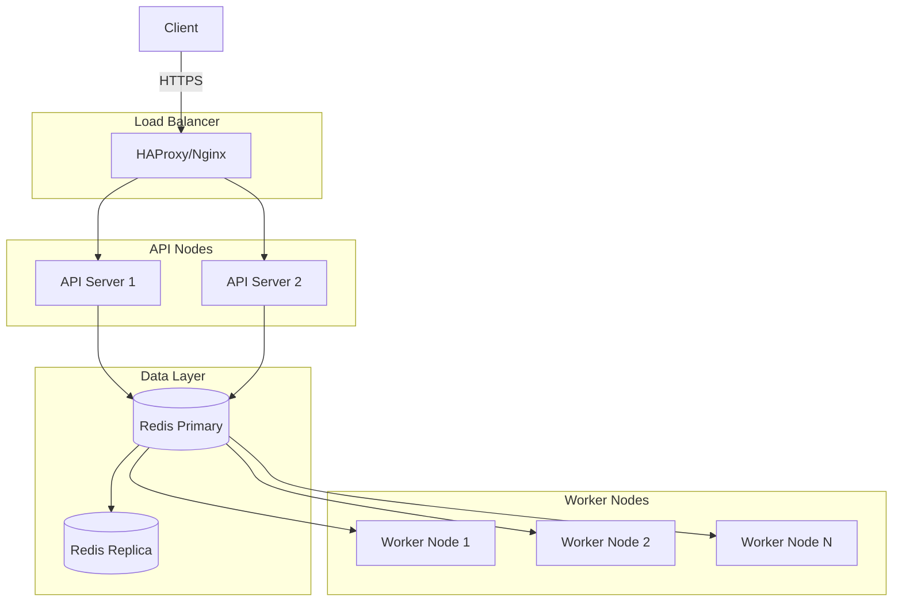

# Cluster Manager Deployment Guide

## Overview

This guide covers deployment strategies for the Cluster Manager in both development and production environments.

## Development Deployment

### Local Development Setup

1. **Prerequisites:**
   ```bash
   # Install Python 3.10+
   python --version
   
   # Install Redis
   # Ubuntu/Debian:
   sudo apt install redis-server
   # macOS:
   brew install redis
   # Windows:
   # Download from https://redis.io/download
   ```

2. **Quick Start:**
   ```bash
   cd cluster-manager
   python -m venv venv
   source venv/bin/activate  # Linux/Mac
   # .\venv\Scripts\activate  # Windows
   
   pip install -r requirements.txt
   cp .env.example .env
   
   # Start Redis
   redis-server
   
   # Start the API server
   python app/main.py
   
   # In another terminal, start Celery workers
   celery -A app.workers worker --loglevel=info
   ```

3. **Verify Installation:**
   ```bash
   # Check API health
   curl http://localhost:8000/health
   
   # Check cluster status
   curl http://localhost:8000/cluster/status
   ```

### Development with Docker

1. **Create `docker-compose.dev.yml`:**
   ```yaml
   version: '3.8'
   
   services:
     redis:
       image: redis:7-alpine
       ports:
         - "6379:6379"
       volumes:
         - redis_data:/data
   
     cluster-manager:
       build:
         context: .
         dockerfile: Dockerfile.dev
       ports:
         - "8000:8000"
       environment:
         - REDIS_HOST=redis
         - API_HOST=0.0.0.0
         - LOG_LEVEL=DEBUG
       volumes:
         - .:/app
       depends_on:
         - redis
       command: uvicorn app.main:app --host 0.0.0.0 --port 8000 --reload
   
     celery-worker:
       build:
         context: .
         dockerfile: Dockerfile.dev
       environment:
         - REDIS_HOST=redis
       volumes:
         - .:/app
       depends_on:
         - redis
       command: celery -A app.workers worker --loglevel=info
   
   volumes:
     redis_data:
   ```

2. **Start development environment:**
   ```bash
   docker-compose -f docker-compose.dev.yml up -d
   ```

## Production Deployment

### Architecture Options

#### Option 1: Single Node Deployment
Best for small clusters or testing environments.



#### Option 2: Multi-Node Deployment
Recommended for production with high availability.



### Production Docker Setup

1. **Production Dockerfile:**
   ```dockerfile
   FROM python:3.11-slim
   
   WORKDIR /app
   
   # Install system dependencies
   RUN apt-get update && apt-get install -y \
       gcc \
       && rm -rf /var/lib/apt/lists/*
   
   # Copy requirements and install Python dependencies
   COPY requirements.txt .
   RUN pip install --no-cache-dir -r requirements.txt
   
   # Copy application code
   COPY app/ ./app/
   
   # Create non-root user
   RUN useradd --create-home --shell /bin/bash app && \
       chown -R app:app /app
   USER app
   
   # Health check
   HEALTHCHECK --interval=30s --timeout=10s --start-period=5s --retries=3 \
       CMD curl -f http://localhost:8000/health || exit 1
   
   EXPOSE 8000
   
   CMD ["uvicorn", "app.main:app", "--host", "0.0.0.0", "--port", "8000"]
   ```

2. **Production Docker Compose:**
   ```yaml
   version: '3.8'
   
   services:
     redis:
       image: redis:7-alpine
       restart: unless-stopped
       ports:
         - "6379:6379"
       volumes:
         - redis_data:/data
         - ./redis.conf:/usr/local/etc/redis/redis.conf
       command: redis-server /usr/local/etc/redis/redis.conf
       healthcheck:
         test: ["CMD", "redis-cli", "ping"]
         interval: 10s
         timeout: 5s
         retries: 3
   
     cluster-manager:
       build:
         context: .
         dockerfile: Dockerfile
       restart: unless-stopped
       ports:
         - "8000:8000"
       environment:
         - REDIS_HOST=redis
         - API_HOST=0.0.0.0
         - LOG_LEVEL=INFO
       env_file:
         - .env.production
       depends_on:
         redis:
           condition: service_healthy
       healthcheck:
         test: ["CMD", "curl", "-f", "http://localhost:8000/health"]
         interval: 30s
         timeout: 10s
         retries: 3
   
     celery-worker:
       build:
         context: .
         dockerfile: Dockerfile
       restart: unless-stopped
       environment:
         - REDIS_HOST=redis
       env_file:
         - .env.production
       depends_on:
         redis:
           condition: service_healthy
       command: celery -A app.workers worker --loglevel=info --concurrency=4
       deploy:
         replicas: 2
   
     nginx:
       image: nginx:alpine
       restart: unless-stopped
       ports:
         - "80:80"
         - "443:443"
       volumes:
         - ./nginx.conf:/etc/nginx/nginx.conf
         - ./ssl:/etc/nginx/ssl
       depends_on:
         - cluster-manager
   
   volumes:
     redis_data:
   ```

### Kubernetes Deployment

1. **Namespace and ConfigMap:**
   ```yaml
   apiVersion: v1
   kind: Namespace
   metadata:
     name: biting-lip
   
   ---
   apiVersion: v1
   kind: ConfigMap
   metadata:
     name: cluster-manager-config
     namespace: biting-lip
   data:
     REDIS_HOST: "redis-service"
     LOG_LEVEL: "INFO"
     API_HOST: "0.0.0.0"
   ```

2. **Redis Deployment:**
   ```yaml
   apiVersion: apps/v1
   kind: Deployment
   metadata:
     name: redis
     namespace: biting-lip
   spec:
     replicas: 1
     selector:
       matchLabels:
         app: redis
     template:
       metadata:
         labels:
           app: redis
       spec:
         containers:
         - name: redis
           image: redis:7-alpine
           ports:
           - containerPort: 6379
           volumeMounts:
           - name: redis-data
             mountPath: /data
         volumes:
         - name: redis-data
           persistentVolumeClaim:
             claimName: redis-pvc
   
   ---
   apiVersion: v1
   kind: Service
   metadata:
     name: redis-service
     namespace: biting-lip
   spec:
     selector:
       app: redis
     ports:
     - port: 6379
       targetPort: 6379
   ```

3. **Cluster Manager Deployment:**
   ```yaml
   apiVersion: apps/v1
   kind: Deployment
   metadata:
     name: cluster-manager
     namespace: biting-lip
   spec:
     replicas: 2
     selector:
       matchLabels:
         app: cluster-manager
     template:
       metadata:
         labels:
           app: cluster-manager
       spec:
         containers:
         - name: cluster-manager
           image: bitinglip/cluster-manager:latest
           ports:
           - containerPort: 8000
           envFrom:
           - configMapRef:
               name: cluster-manager-config
           resources:
             requests:
               memory: "512Mi"
               cpu: "250m"
             limits:
               memory: "1Gi"
               cpu: "500m"
           livenessProbe:
             httpGet:
               path: /health
               port: 8000
             initialDelaySeconds: 30
             periodSeconds: 10
           readinessProbe:
             httpGet:
               path: /health
               port: 8000
             initialDelaySeconds: 5
             periodSeconds: 5
   
   ---
   apiVersion: v1
   kind: Service
   metadata:
     name: cluster-manager-service
     namespace: biting-lip
   spec:
     selector:
       app: cluster-manager
     ports:
     - port: 80
       targetPort: 8000
     type: LoadBalancer
   ```

## Configuration Management

### Environment Variables

#### Development (.env.development)
```bash
# API Configuration
API_HOST=localhost
API_PORT=8000
API_KEY=dev-api-key-12345

# Redis Configuration
REDIS_HOST=localhost
REDIS_PORT=6379
REDIS_DB=0

# Logging
LOG_LEVEL=DEBUG
LOG_FORMAT=text

# Development flags
DEBUG=true
RELOAD=true
```

#### Production (.env.production)
```bash
# API Configuration
API_HOST=0.0.0.0
API_PORT=8000
API_KEY=${CLUSTER_API_KEY}

# Redis Configuration
REDIS_HOST=redis-cluster.internal
REDIS_PORT=6379
REDIS_DB=0
REDIS_PASSWORD=${REDIS_PASSWORD}

# Logging
LOG_LEVEL=INFO
LOG_FORMAT=json

# Security
SSL_CERT_PATH=/etc/ssl/certs/cluster-manager.crt
SSL_KEY_PATH=/etc/ssl/private/cluster-manager.key

# Performance
WORKER_PROCESSES=4
MAX_CONNECTIONS=1000
```

### Secrets Management

#### Using Docker Secrets
```yaml
services:
  cluster-manager:
    image: bitinglip/cluster-manager:latest
    secrets:
      - api_key
      - redis_password
    environment:
      - API_KEY_FILE=/run/secrets/api_key
      - REDIS_PASSWORD_FILE=/run/secrets/redis_password

secrets:
  api_key:
    external: true
  redis_password:
    external: true
```

#### Using Kubernetes Secrets
```yaml
apiVersion: v1
kind: Secret
metadata:
  name: cluster-manager-secrets
  namespace: biting-lip
type: Opaque
data:
  api-key: <base64-encoded-api-key>
  redis-password: <base64-encoded-redis-password>
```

## Monitoring and Observability

### Prometheus Metrics

1. **Enable metrics endpoint in FastAPI:**
   ```python
   from prometheus_client import make_asgi_app, Counter, Histogram
   
   REQUEST_COUNT = Counter('http_requests_total', 'Total HTTP requests', ['method', 'endpoint'])
   REQUEST_DURATION = Histogram('http_request_duration_seconds', 'HTTP request duration')
   
   # Add metrics endpoint
   metrics_app = make_asgi_app()
   app.mount("/metrics", metrics_app)
   ```

2. **Prometheus configuration:**
   ```yaml
   scrape_configs:
     - job_name: 'cluster-manager'
       static_configs:
         - targets: ['cluster-manager:8000']
       metrics_path: /metrics
       scrape_interval: 15s
   ```

### Logging

1. **Structured logging configuration:**
   ```python
   import structlog
   
   structlog.configure(
       processors=[
           structlog.stdlib.filter_by_level,
           structlog.stdlib.add_log_level,
           structlog.stdlib.PositionalArgumentsFormatter(),
           structlog.processors.TimeStamper(fmt="iso"),
           structlog.processors.StackInfoRenderer(),
           structlog.processors.format_exc_info,
           structlog.processors.JSONRenderer()
       ],
       context_class=dict,
       logger_factory=structlog.stdlib.LoggerFactory(),
       wrapper_class=structlog.stdlib.BoundLogger,
       cache_logger_on_first_use=True,
   )
   ```

2. **Log aggregation with ELK Stack:**
   ```yaml
   version: '3.8'
   services:
     elasticsearch:
       image: elasticsearch:8.5.0
       environment:
         - discovery.type=single-node
         - xpack.security.enabled=false
       ports:
         - "9200:9200"
   
     logstash:
       image: logstash:8.5.0
       volumes:
         - ./logstash.conf:/usr/share/logstash/pipeline/logstash.conf
       depends_on:
         - elasticsearch
   
     kibana:
       image: kibana:8.5.0
       ports:
         - "5601:5601"
       depends_on:
         - elasticsearch
   ```

## Security Hardening

### Network Security

1. **Firewall rules:**
   ```bash
   # Allow only necessary ports
   ufw allow 22/tcp    # SSH
   ufw allow 80/tcp    # HTTP
   ufw allow 443/tcp   # HTTPS
   ufw deny 6379/tcp   # Redis (internal only)
   ufw deny 8000/tcp   # API (behind proxy)
   ```

2. **TLS Configuration:**
   ```nginx
   server {
       listen 443 ssl http2;
       server_name cluster-manager.bitinglip.com;
   
       ssl_certificate /etc/ssl/certs/cluster-manager.crt;
       ssl_certificate_key /etc/ssl/private/cluster-manager.key;
       ssl_protocols TLSv1.2 TLSv1.3;
       ssl_ciphers HIGH:!aNULL:!MD5;
   
       location / {
           proxy_pass http://localhost:8000;
           proxy_set_header Host $host;
           proxy_set_header X-Real-IP $remote_addr;
           proxy_set_header X-Forwarded-For $proxy_add_x_forwarded_for;
           proxy_set_header X-Forwarded-Proto $scheme;
       }
   }
   ```

### Application Security

1. **API Rate Limiting:**
   ```python
   from slowapi import Limiter, _rate_limit_exceeded_handler
   from slowapi.util import get_remote_address
   from slowapi.errors import RateLimitExceeded
   
   limiter = Limiter(key_func=get_remote_address)
   app.state.limiter = limiter
   app.add_exception_handler(RateLimitExceeded, _rate_limit_exceeded_handler)
   
   @app.get("/api/v1/cluster/status")
   @limiter.limit("10/minute")
   async def get_cluster_status(request: Request):
       pass
   ```

2. **Input Validation:**
   ```python
   from pydantic import BaseModel, validator
   
   class TaskRequest(BaseModel):
       task_type: str
       model_name: str
       parameters: dict
   
       @validator('task_type')
       def validate_task_type(cls, v):
           allowed_types = ['text_generation', 'image_generation']
           if v not in allowed_types:
               raise ValueError(f'Invalid task type: {v}')
           return v
   ```

## Backup and Recovery

### Data Backup

1. **Redis backup:**
   ```bash
   # Automated backup script
   #!/bin/bash
   BACKUP_DIR="/backup/redis"
   DATE=$(date +%Y%m%d_%H%M%S)
   
   # Create backup
   redis-cli BGSAVE
   cp /var/lib/redis/dump.rdb "$BACKUP_DIR/dump_$DATE.rdb"
   
   # Cleanup old backups (keep last 7 days)
   find "$BACKUP_DIR" -name "dump_*.rdb" -mtime +7 -delete
   ```

2. **Configuration backup:**
   ```bash
   # Backup configuration files
   tar -czf "config_backup_$(date +%Y%m%d).tar.gz" \
       .env.production \
       nginx.conf \
       redis.conf \
       docker-compose.yml
   ```

### Disaster Recovery

1. **Recovery procedures:**
   ```bash
   # Stop services
   docker-compose down
   
   # Restore Redis data
   cp /backup/redis/dump_latest.rdb /var/lib/redis/dump.rdb
   
   # Restore configuration
   tar -xzf config_backup_latest.tar.gz
   
   # Start services
   docker-compose up -d
   ```

2. **Health check after recovery:**
   ```bash
   # Verify services
   curl http://localhost:8000/health
   redis-cli ping
   
   # Check logs
   docker-compose logs cluster-manager
   docker-compose logs celery-worker
   ```

## Performance Tuning

### Redis Optimization

```bash
# redis.conf optimizations
maxmemory 2gb
maxmemory-policy allkeys-lru
save 900 1
save 300 10
save 60 10000
tcp-keepalive 300
timeout 0
```

### API Server Tuning

```python
# uvicorn with multiple workers
uvicorn app.main:app \
    --host 0.0.0.0 \
    --port 8000 \
    --workers 4 \
    --worker-class uvicorn.workers.UvicornWorker
```

### Celery Optimization

```bash
# Celery worker with optimizations
celery -A app.workers worker \
    --loglevel=info \
    --concurrency=4 \
    --prefetch-multiplier=1 \
    --max-tasks-per-child=1000
```

## Troubleshooting

### Common Issues

1. **Service won't start:**
   ```bash
   # Check logs
   docker-compose logs cluster-manager
   
   # Check configuration
   docker-compose config
   
   # Verify environment
   docker-compose exec cluster-manager env
   ```

2. **Redis connection issues:**
   ```bash
   # Test Redis connectivity
   redis-cli -h redis-host ping
   
   # Check Redis logs
   docker-compose logs redis
   
   # Verify network
   docker network ls
   docker network inspect <network_name>
   ```

3. **Performance issues:**
   ```bash
   # Monitor resource usage
   docker stats
   
   # Check API response times
   curl -w "@curl-format.txt" -o /dev/null -s http://localhost:8000/health
   
   # Monitor Redis performance
   redis-cli --latency-history
   ```
